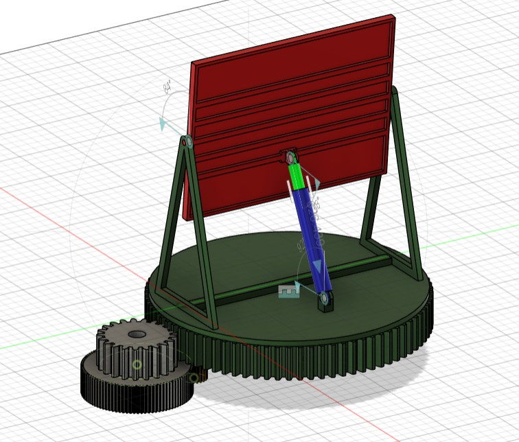
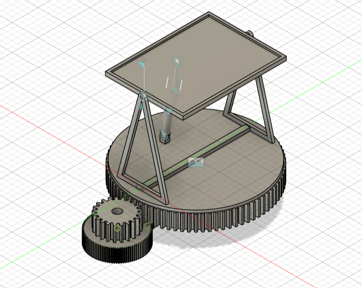
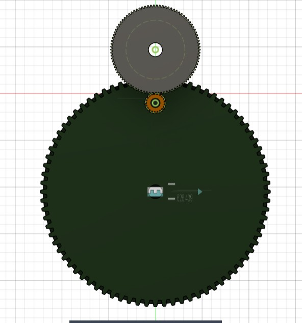
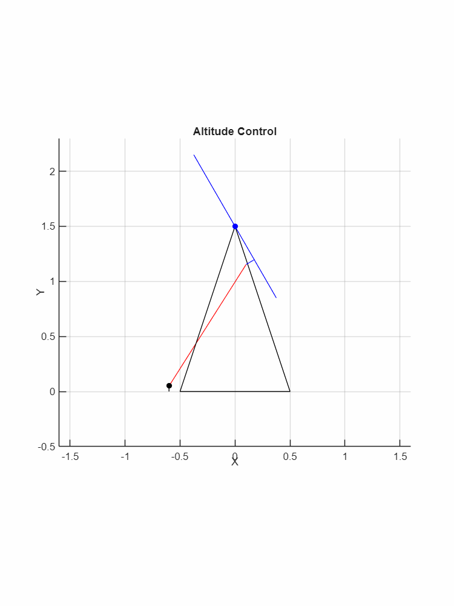
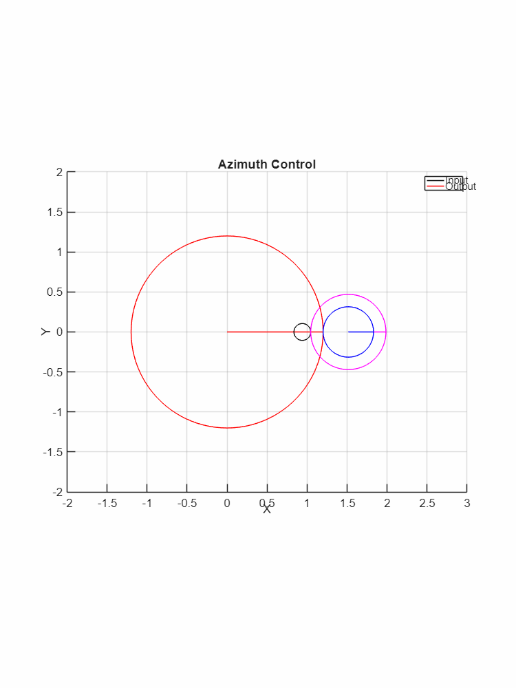
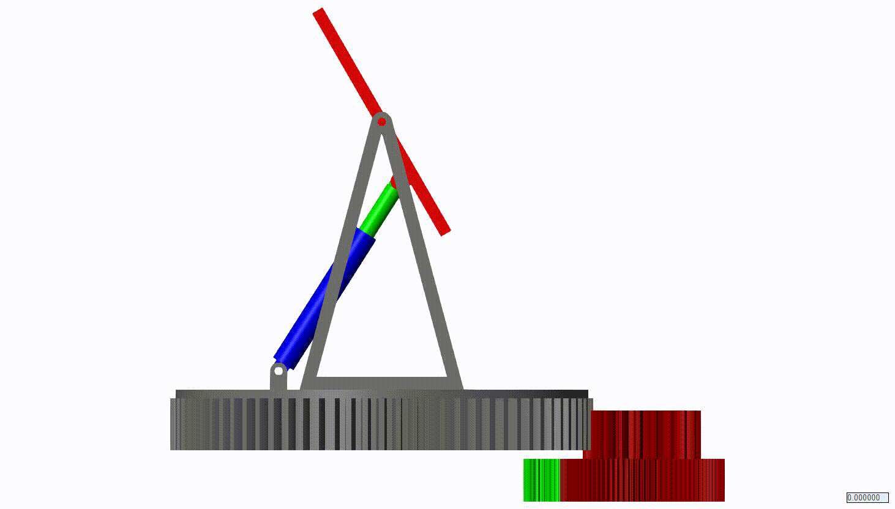

# Mechanism Simulation using (Matlab) Symbolic Math Toolbox.

This is a simulation of the movement of a Solar Panel Pan-Tilt system (a system for adjusting the rotation and tilt of the solar panel). The operation is divided into two main parts, which are plotted as follows

1. Altitude Control (Tilt) System Design

1.1 Support Base: The support base (black triangular structure) is fixed and stationary.

1.2 Actuator: The piston cylinder (red line), which functions as the actuator, extends or retracts.

1.3 Tilting Motion: This in-out movement pushes or pulls the solar panel mount (blue dot/connection point), causing the panel to tilt up or down to adjust the angle of light reception.

2. Azimuth Control (Pan) System Design

2.1 Drive Power: The drive power originates from the motor drive gear (black circle).

2.2 Gear Reduction: This gear transmits power to the reduction gear set (pink and blue circles). This set adjusts the gear ratio, resulting in slower rotation but higher torque.

2.3 Final Drive (Output): The reduction gear set then drives the ring gear (red circle - Output), which serves as the large rotating base for mounting the entire solar panel structure.

When completed, the simulation will be:

